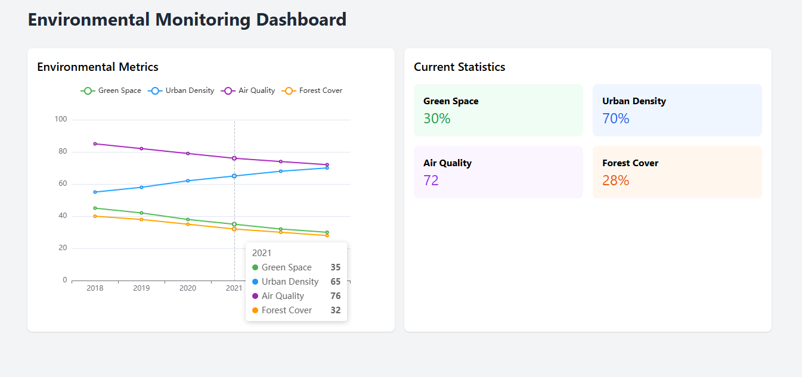

# 🌍 **Satellite-Based Environmental Monitoring System** 🚀

## 🌿 Real-Time Environmental Tracking Powered by Satellite Data

A cutting-edge system that tracks environmental changes using satellite data, visualized in real-time through interactive dashboards. This project is designed to monitor urban development, air quality, forest cover, and green spaces, all with seamless integration using Node.js, Express, and ECharts.


---

## 🚀 **Key Features**

- **Real-Time Monitoring**: Visualize live environmental data on urban development, air quality, and green space.
- **Interactive Dashboards**: Dive into time series charts and explore historical data trends.
- **API Access**: Simple REST API for seamless data access and integration.
- **Mobile-Optimized**: Fully responsive design to monitor environmental changes on any device.

---

## 📊 **Latest Environmental Metrics (2018-2023)**

| **Year** | **Green Space** | **Urban Density** | **Air Quality** | **Forest Cover** |
|----------|-----------------|-------------------|-----------------|------------------|
| **2018** | 45%             | 55%               | 85              | 40%              |
| **2019** | 42%             | 58%               | 82              | 38%              |
| **2020** | 38%             | 62%               | 79              | 35%              |
| **2021** | 35%             | 65%               | 76              | 32%              |
| **2022** | 32%             | 68%               | 74              | 30%              |
| **2023** | 30%             | 70%               | 72              | 28%              |

---

### 🔍 **Key Findings**:

- 🌳 **15% decrease** in urban green spaces over 5 years
- 🏘️ **27% increase** in urban density
- 💨 **13-point drop** in air quality indices
- 🌲 **12% reduction** in forest cover

---

## 🛠 **Tech Stack**

- **Backend**: Node.js, Express.js
- **Frontend**: ECharts, Tailwind CSS
- **Database**: Sample satellite data (for NASA Earth Data integration)

---

## ⚡ **Quick Start Guide**

To get the environmental monitoring system running locally, follow these steps:

1. **Clone the repository**:
   ```bash
   git clone https://github.com/yourusername/environmental-monitor.git
   ```
2. **Install dependencies**:
   ```bash
   npm install
   ```
3. **Start the server**:
   ```bash
   npm start
   ```
4. **Access the Dashboard**:
   Open your browser and visit: [http://localhost:3000](http://localhost:3000)

---

## 🌐 **API Endpoints**

### `GET /api/environmental-data`
- Fetches environmental data (time series metrics).

**Response Format**:
```json
[
  {
    "date": "2023",
    "greenSpace": 30,
    "urbanDensity": 70,
    "airQuality": 72,
    "forestCover": 28
  }
]
```

---

## 📈 **Sample Data Analysis**

The sample data currently used includes:

| Metric         | Description             | Sample Range |
|----------------|-------------------------|--------------|
| Green Space    | Vegetation coverage      | 30-45%       |
| Urban Density  | Built-up area            | 55-70%       |
| Air Quality    | Air quality index        | 72-85        |
| Forest Cover   | Forest coverage          | 28-40%       |

---

## 🔧 **Configuration**  

- **PORT**: 3000
- **NODE_ENV**: development

### Development Mode:
To run in development mode, use:
```bash
npm run dev
```

---

## 🛠 **Project Structure**

```
.
├── index.html          # Main dashboard interface
├── app.js              # Frontend logic
├── server.js           # Express server configuration
├── style.css           # Custom styles
└── package.json        # Project dependencies
```

---

## 📚 **Contributing**

1. Fork the repository
2. Create a new branch (`git checkout -b feature/YourFeature`)
3. Commit your changes (`git commit -m 'Add amazing feature'`)
4. Push your changes (`git push origin feature/YourFeature`)
5. Open a Pull Request

---

## 🚀 **Future Enhancements**

- Real-time API Integrations
- User Authentication
- Data Export Capabilities
- More Visualization Types
- Historical Data Comparison

---

## 🙏 **Acknowledgments**

- Satellite data inspired by NASA Earth Data
- Dashboard design influenced by modern environmental monitoring systems

---

## ⚠️ **License**  
This project is licensed under the MIT License.
